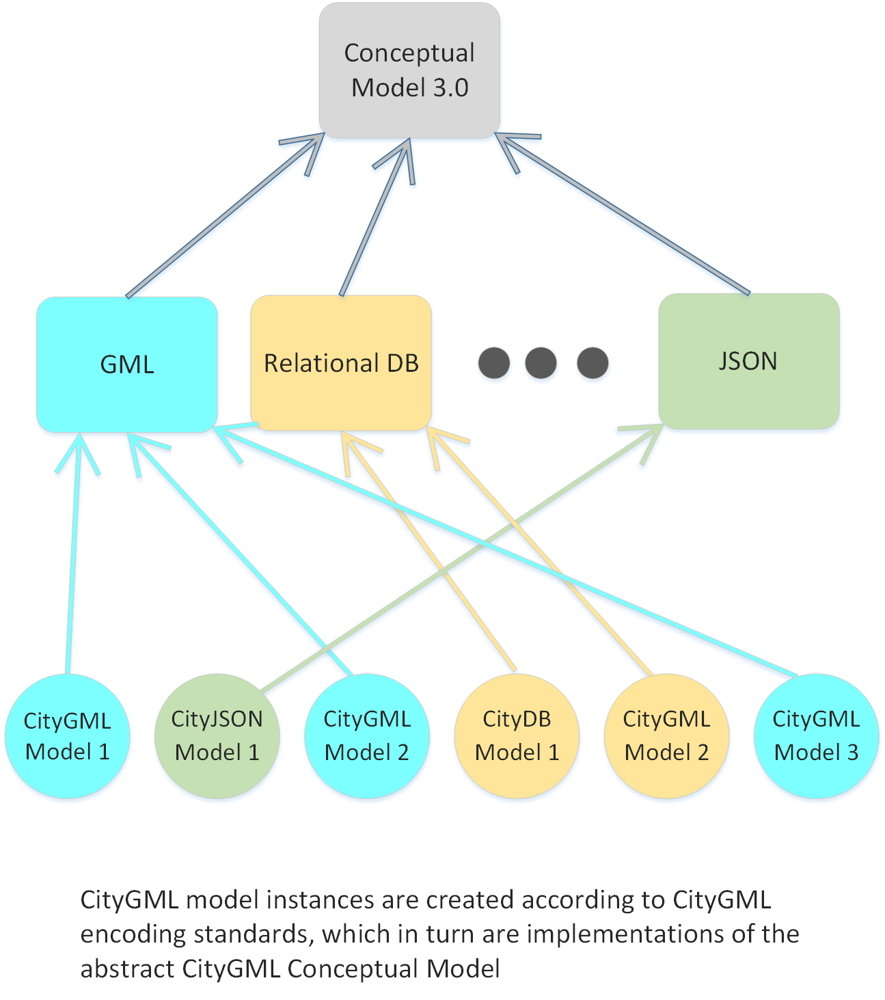

The spreadsheet summarising the progress on the github issues in the bi-weekly web conferences can be accessed here: https://docs.google.com/spreadsheets/d/1W125JKqL2CztRiU8RSRXa8cIRJm3TB5Fdue8OtC0pIg/edit#gid=105567035

The CityGML 3.0 Conceptual Model Standard is available in [PDF](http://docs.ogc.org/DRAFTS/20-010.pdf) and [HTML](http://docs.ogc.org/DRAFTS/20-010.html)

A CityGML 3.0 Users Guide is provided in addition to the CityGML 3.0 standard. The Users Guide provides non-normative information which may be of value to users of the Standard. 

The CityGML 3.0 Users Guide is available in [PDF](http://docs.ogc.org/DRAFTS/20-066.pdf) and [HTML](http://docs.ogc.org/DRAFTS/20-066.html)

---

CityGML 3.0 Conceptual Model
===========
Overview
--
This is the public repository for the Open Geospatial Consortium (OGC) CityGML Standards Working Group (SWG) CityGML version 3.0 Conceptual Model standard. 
Discovery, discussions, and the raising and resolution of issues regarding the Conceptual Model are focussed here and under the OGC policies and procedures for the adoption of results by the SWG.
Interested reviewers and participants should use the Issues tab to direct questions, comments, criticisms, and issues toward the chairs or other relevant party. Consensus and mutual understanding is the goal. 
The contributor understands that any contributions, if accepted by the OGC Membership, shall be incorporated into OGC standards documents and that all copyright and intellectual property shall be vested to the OGC.

Scope
--

CityGML version 3.0 consists of a single *Conceptual Model* and multiple implementations of the conceptual model using different data definition and data storage methodologies. Each storage methodology is designated as a named *Encoding*. This scope of this repository is only the Conceptual Model. Note that this *may* include dependencies of some or all Encodings on specific characteristics of the Conceptual Model. In particular, since the ShapeChange 
[https://shapechange.net/targets/xsd/]
 tool automates implementation of an XML Encoding of the Conceptual Model as an XML schema, compatibility with ShapeChange is a weak dependency. The team editing the draft UML expression of the Conceptual Model has had to ensure the implementability via ShapeChange either by adjusting the Conceptual Model or enhancing ShapeChange. There will certainly be other dependencies discovered or expressed as development of other Encodings progresses. 

Role of SIG 3D
--

The work of the Special Interest Group 3D (SIG 3D) of the initiative Geodata  Infrastructure Germany (GDI-DE) has been instrumental in the further development of CityGML, especially revision of the concept of level-of-detail (LOD).

Naming
--

The name *CityGML* has been retained from older versions (2.0 and earlier) where the only storage methodology was OGC Geographic Markup Language (GML). The SWG recognises the potential for confusion in naming the Conceptual Model CityGML, because GML is also the name of an Encoding. Other choices were considered, including *CityModel* and *City**, but after extensive discussion, the value of keeping the well-known name CityGML was decisive in a SWG vote to retain the name CityGML.

Purpose
--

The purpose of CityGML is to enable the construction of semantically-typed physical models of portions of the natural and built environment in size from a few tens of square meters upward. Historically, CityGML models have mostly ranged from the size of a venue or small district to the area of a large city. 

CityGML models capture the physical structure and human concepts of natural and built environments that do or could exist.

The ontology that supports the semantic structure is inherently derived from human concepts of the natural and built environments. It will inevitably have a cultural bias toward the developers and users of the ontology. To the extent possible, CityGML concepts are modularised and extensible so that new types of environments may be defined and included in models without breaking backward compatibility.

High-Level Use Cases
--

The top-level use cases for CityGML models can be divided into five groups:

- **Archive** is creation and use of a model for the purpose of preservation of the former or current state of an environment, or the preservation of a proposed environment, for example an existing city, an archaeological site, or a new airport. Even though the principle reason for modelling is to capture an environment, archived models will normally also be used in one or more of the following top-level use cases.
- **Visualisation** is generation of views of a modelled environment from diverse or unlimited points of view for the purpose of publishing the environment and its component elements in a way that is well integrated with native human perception of a three-dimensional world, optionally with the flow of time. Visualisation is often the best way to convey the overall nature of a modelled environment.

- **Navigation** is the guidance of people or vehicles through a modelled environment. It may also include the derivation of guidance data, such as IndoorGML, from a model for the purpose of navigation. Semantic structure enables route-finding and guidance in terms of object categories that are directly meaningful to humans. For example, a door can afford transition between two enclosed spaces and a roadway is strong enough, large enough, and smooth enough to afford motion of wheeled vehicles.

- **Simulation** is the use of a model as a substitute for the corresponding real-world environment for the purpose of conducting experiments relating to its behaviour in terms of electromagnetic wave propagation, sound propagation, flooding effects, blast effects, lighting, earthquakes, and other physical processes.

- **Analysis** is the use of a model to determine properties and characteristics of the modelled environment such as solar electric and heating potential, viewsheds and lines-of-sight, obstructions to flight, parcel contents, and other intrinsic joint properties of the modelled elements.

Conceptual Model Details
---

Definition

The Conceptual Model is an abstract definition of the structure implemented by a concrete instance of a complete CityGML model or CityGML fragment.

Purpose

The purpose of the Conceptual Model is to define the concepts to be implemented by specific Encodings. There can be no direct implementation of the Conceptual Model.

Use

The Conceptual Model is used as a framework for the implementation of methods of expressing CityGML using specific encoding methodologies. Requirements on representations in individual Encodings should be derived from the Conceptual Model. Most Encodings will not have a direct mapping of every detail of every structure and property in the Conceptual Model. It is the responsibility of the specific Encoding standard to define how the Encoding meets the representational requirements of the Conceptual Model and to identify gaps, ambiguities, and mis-mappings.

Characteristics and requirements

CityGML can represent complete environments or disconnected pieces, including generic elements such as trees or road signs. A representation of a complete environment is called a [complete] *model*. Complete models are required for all use cases except visualisation. It is highly recommended that any model of an environment be a complete model.
A representation of a disconnected piece is called a *fragment*.  Fragments may be physically stored as discrete elements, for example individual files, but these elements are only suitable as data components used in construction of complete models. 

Encodings
--

Several Encodings (GML, relational database/SQL, JSON) are in commercial use with CityGML 2.0. It is likely that these will be updated to comply with the changes in the 3.0 Conceptual Model but, as of July 2018, results provided by the Work Package 2 team led by the Technische Universitaet Muenchen are only available for GML. Please refer to the separate GML section of the CityGML Encodings repository at [https://github.com/opengeospatial/CityGML-3.0Encodings/tree/master/CityGML] for details. 

Because implementability of the Conceptual Model via one or more encodings is a practical requirement for any use of CityGML it is important to be able to test various aspects of the Conceptual Model through experimental Encodings during development of the Conceptual Model. These can be found at [https://github.com/opengeospatial/CityGML-3.0Encodings/tree/master/CityGML/Examples].

